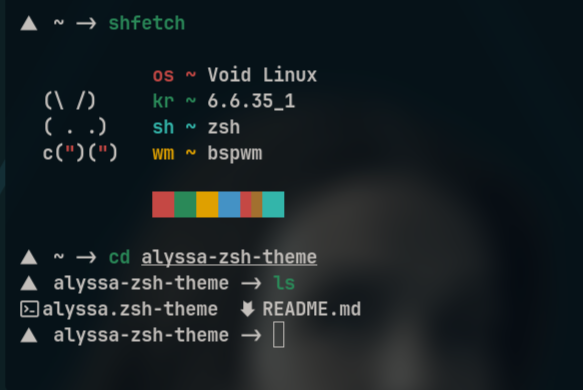

## alyssa-zsh-theme
Personal and minimalist theme for zsh



### Installation

- Requisites
    - ohmyzsh (https://github.com/ohmyzsh/ohmyzsh)
    - git

```sh
cd ~/.oh-my-zsh/themes
git clone https://github.com/alisanoelia/alyssa-zsh-theme.git
```

Add it to your `~/.zshrc`

`ZSH_THEME="alyssa"
`
